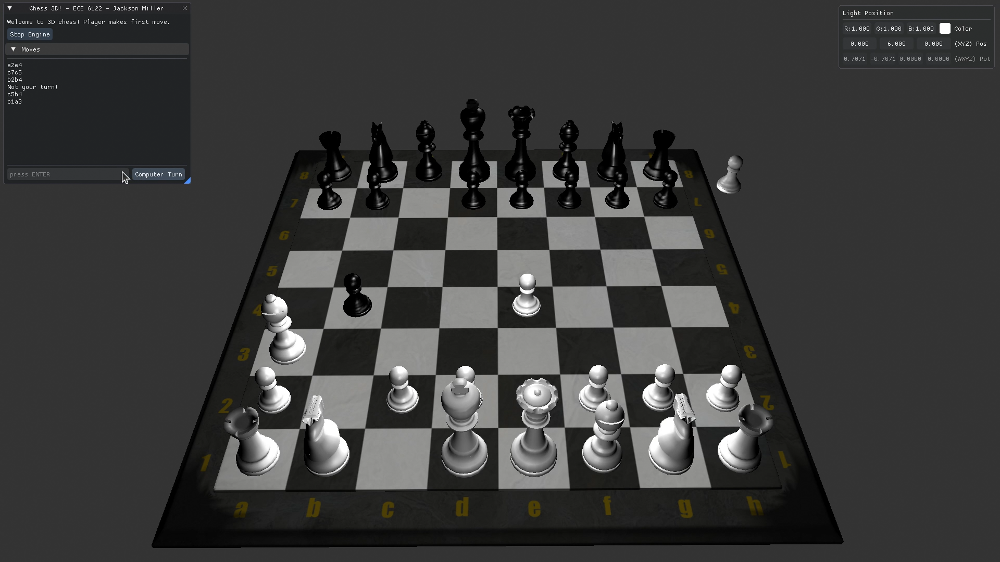

# [Chess 3D](https://github.com/jack-mil/chess-3d)

Quick and dirty 3D scene rendering with `stockfish` chess engine integration for a required course project.

### Controls 
    - LMB: Orbit Camera
    - RMB: Pan Camera
    - Scroll: Zoom in/out

### Building
- Required: Cmake and a C++20 std library capable compiler (e.g. GCC > 9 )
- Configure: `$ cmake -B build`
- Compile: `$ cmake --build build --target chess3d`

Output is `./build/chess3d`.

The [`stockfish`](https://stockfishchess.org/) chess engine binary is required at runtime (available on $PATH).

### Dependencies
Developed on Arch Linux using [Ogre 3D](https://www.ogre3d.org/) (`ogre` package).
Other dependencies are cloned and compiled by CMake at build-time ([`fmt`](https://github.com/fmtlib/fmt), [`chess-library`](https://github.com/Disservin/chess-library), [`uciadaptor`](https://gitlab.com/manzerbredes/uciadapter.git))

Targets in the `examples/` subfolder were just me getting used to the various libraries I was going to use.

The CMakePresets.json contains options specific to my machine and toolchain (Ninja Multi-Config, [Mold linker](https://gitlab.com/manzerbredes/uciadapter.git), [ccache](https://ccache.dev/), parallel jobs, etc.)

### Reference
- The Console widget from: [Dear ImGUI demo widgets](https://github.com/ocornut/imgui/blob/master/imgui_demo.cpp).
- Similar Dear ImGui example from: [MPV Debug plugin](https://github.com/tsl0922/mpv-debug-plugin).
- ImGui color theme from: [Basic electrical simulation software (BESS)](https://github.com/shivang51/bess/blob/main/Bess/src/settings/themes.cpp)

